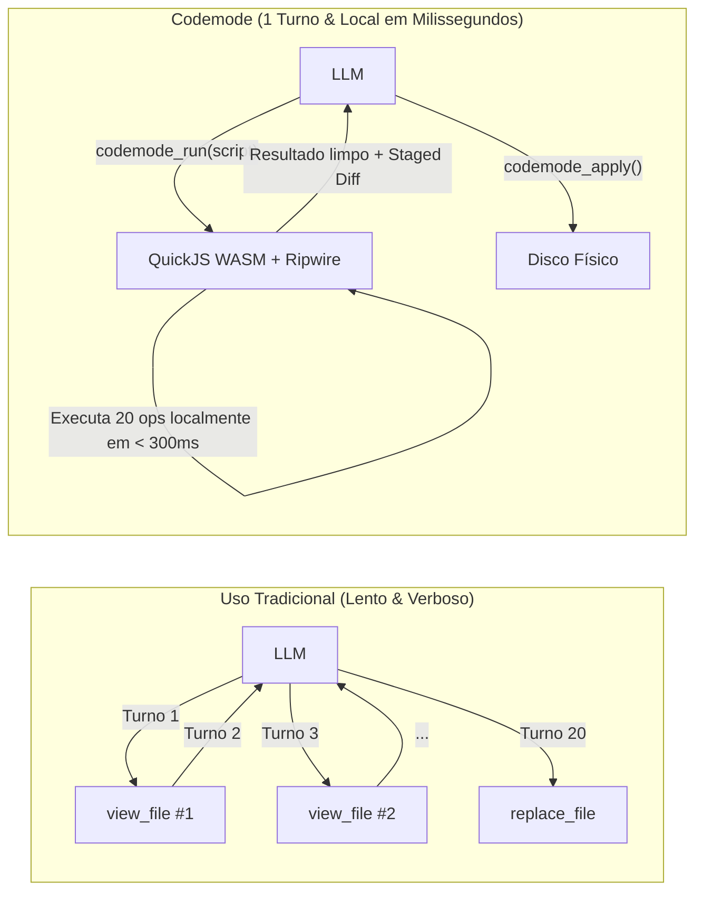

# Guia de Uso: Plugin Codemode para Google Antigravity

> **Versão:** 1.0.0  
> **Arquitetura:** QuickJS WebAssembly Sandbox + Ripwire v0.6.5 + Staging Filesystem  
> **Protocolo:** Model Context Protocol (MCP stdio)

---

## 1. O que é o Codemode e Por Que Usá-lo?

No modelo tradicional de assistência de IA (*Tool Calling* sequencial), tarefas complexas de exploração ou refatoração geram um gargalo de latência e consumo de tokens:
- **Modelo Tradicional:** O LLM precisa executar 15 a 30 chamadas individuais (`list_directory`, `view_file`, `grep_search`, `replace_file_content`), fazendo uma viagem de ida e volta (round-trip) à nuvem em cada uma delas. Cada chamada consome tokens de prompt e resposta, acumulando dezenas de segundos de espera.
- **Modelo Codemode:** O LLM escreve um **único script assíncrono em JavaScript** e o envia para o ambiente local via `codemode_run`. O script roda em milissegundos dentro de uma máquina virtual QuickJS compilada em WebAssembly, navega pelo grafo de código com o Ripwire, filtra os dados na memória do sandbox e devolve **apenas o resultado consolidado e o diff final**.



---

## 2. Ferramentas MCP Expostas ao Antigravity

O plugin expõe 3 ferramentas principais no servidor MCP:

### 2.1. `codemode_run`
Executa o código JavaScript assíncrono dentro do sandbox seguro.
- **Parâmetros:**
  - `code` (string, obrigatório): Corpo assíncrono do script JavaScript a executar.
  - `timeoutMs` (number, opcional): Tempo limite de execução (padrão: 60.000 ms).
- **Garantia de Staging-first:** Mutações no sistema de arquivos não alteram o disco físico imediatamente. Elas são gravadas na área de staging em memória e devolvidas no campo `=== Alterações em Staging ===` com um diff unificado.

### 2.2. `codemode_apply`
Aplica atomicamente no disco real todas as alterações mantidas em staging que foram inspecionadas no `codemode_run`.
- **Proteções:** Verificação otimista de concorrência (se o arquivo foi alterado externamente, aborta), gravação via arquivos `.tmp`, renomeação atômica e backup com rollback automático caso ocorra falha de I/O.

### 2.3. `codemode_discard`
Limpa e descarta a área de staging em memória, cancelando quaisquer edições pendentes sem tocar no disco.

---

## 3. Catálogo de Ferramentas Dentro do Script (`tools.*`)

Dentro do código JavaScript enviado para `codemode_run`, você tem acesso ao objeto global `tools`:

### 3.1. Navegação de Código e Inteligência (Ripwire)

| Método | Assinatura | Descrição |
| :--- | :--- | :--- |
| `tools["ripwire.map"]` | `({ path?, topK?, maxTokens? })` | Retorna os símbolos centrais do projeto ranqueados por **Personalized PageRank**. |
| `tools["ripwire.callers"]` | `({ symbol, path? })` | Localiza todos os chamadores diretos (in-edges de 1 salto) de uma função ou classe. |
| `tools["ripwire.uses"]` | `({ symbol, path? })` | Localiza onde o símbolo é lido, gravado, importado ou chamado no repositório. |
| `tools["ripwire.impact"]` | `({ symbol, path? })` | **Blast Radius**: Calcula todo o grafo transitivo de impacto e arquivos importadores antes de uma refatoração. |
| `tools["ripwire.for"]` | `({ task, path?, signaturesOnly? })` | **Task Lens**: Gera o bundle de assinaturas e âncoras ideais para uma tarefa descrita em linguagem natural. |
| `tools["ripwire.around"]` | `({ symbol, depth? })` | Retorna o ego-graph local ao redor de um símbolo. |

### 3.2. Sistema de Arquivos Seguro (Windows NTFS Confinado)

| Método | Assinatura | Descrição |
| :--- | :--- | :--- |
| `tools.readFile` | `({ path, offset?, limit? })` | Leitura parcial ou total segura. Protegida contra TOCTOU via checagem `dev`/`ino` em 64 bits. |
| `tools.glob` | `({ pattern, cwd?, ignore? })` | Busca recursiva por arquivos confinados ao workspace (ignora `.git`, segredos e `node_modules`). |
| `tools.grep` | `({ query, path?, isRegex?, caseSensitive? })` | Busca rápida por texto ou regex. Totalmente imune a ReDoS via Worker Threads dedicadas com timeout. |
| `tools.writeFile` | `({ path, content })` | Grava o conteúdo de um arquivo na área de **staging em memória**. |
| `tools.editFile` | `({ path, oldText, newText })` | Substituição exata de ocorrência única em staging (sem armadilhas de expansão de `$1`, `$$`). |
| `tools.getStagedDiff`| `()` | Retorna o patch/diff unificado de todas as alterações retidas em staging. |
| `tools.discardStaged`| `()` | Limpa a área de staging atual. |

---

## 4. Receitas Práticas (Snippets de Uso)

### Receita 1: Orientação Imediata em Codebase Desconhecida
```javascript
// Descobre os símbolos mais importantes do repositório em < 200ms
const map = await tools["ripwire.map"]({ topK: 12 });

console.log(`Repositório indexado: ${map.files} arquivos, ${map.symbols} símbolos.`);

return {
  arquivosPrincipais: map.r.map(file => ({
    arquivo: file.p,
    simbolos: file.s.map(s => `${s.t} ${s.n}`)
  }))
};
```

### Receita 2: Análise de Blast Radius Antes de Refatorar
```javascript
// "Quero alterar a assinatura de resolvePath. Quem será afetado?"
const callers = await tools["ripwire.callers"]({ symbol: "resolvePath" });
const blastRadius = await tools["ripwire.impact"]({ symbol: "resolvePath" });

return {
  totalChamadores: callers.count,
  chamadores: callers.callers.map(c => `${c.n} em ${c.p}`),
  arquivosAfetadosPeloImpacto: blastRadius.import_reach.map(i => i.p)
};
```

### Receita 3: Refatoração em Lote com Validação e Staging
```javascript
// Atualiza a versão de uma dependência em múltiplos package.json de forma atômica
const packages = await tools.glob({ pattern: "**/package.json" });
let alterados = 0;

for (const pkgPath of packages) {
  const content = await tools.readFile({ path: pkgPath });
  if (content.includes('"vitest": "^3.0.0"')) {
    await tools.editFile({
      path: pkgPath,
      oldText: '"vitest": "^3.0.0"',
      newText: '"vitest": "^3.2.7"'
    });
    alterados++;
  }
}

return { totalArquivosInspecionados: packages.length, alterados };
// Após rodar, inspecione o diff no retorno e chame 'codemode_apply' para cometer no disco!
```

---

## 5. Fluxo de Trabalho Recomendado

1. **Investigar**: Use `codemode_run` com ferramentas `ripwire.*` para entender o fluxo de dados e callers.
2. **Transformar**: Use `tools.editFile` ou `tools.writeFile` dentro do script para aplicar as edições em staging.
3. **Revisar**: Observe a seção `=== Alterações em Staging ===` exibida na saída do `codemode_run`.
4. **Cometer**: Invoque a ferramenta MCP `codemode_apply` para persistir as alterações atômicas no disco físico.
