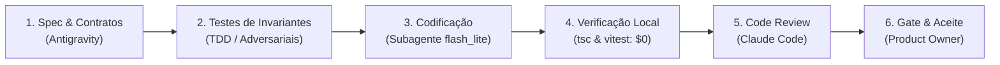

# Governança do Time e Metodologia SDD

> **Projeto:** Plugin Codemode para Google Antigravity  
> **Metodologia:** Spec-Driven Development (SDD) com Otimização de Custos  
> **Data de Formalização:** 02/10/2026  

---

## 1. Composição do Time e Papéis

O desenvolvimento deste plugin segue uma divisão funcional estrita, otimizando custo de inferência, rigor de segurança e velocidade de entrega:

| Papel | Integrante | Responsabilidade |
| :--- | :--- | :--- |
| **Product Owner & Arquiteto Chefe** | **Você (Usuário)** | • Define prioridades de negócio e casos de uso. • Revisa e aprova as especificações técnicas. • Concede o aceite formal (*Gate Review*) ao fim de cada fase. |
| **Engenheiro Líder & Arquiteto de Software** | **Antigravity** | • Desenha a arquitetura geral e as especificações formais (Specs). • Coordena os subagentes e a execução do projeto. • Prepara suites de testes de invariantes e validações locais. |
| **Implementador / Codificador Econômico** | **Subagentes (`flash_lite` / `flash`)** | • Implementação de código TypeScript estritamente conforme a Spec. • Tarefas mecânicas de conversão de dados, boilerplate e preenchimento de interfaces. • Resolução de falhas de tipagem acusadas pelo compilador. |
| **Motor de Verificação Determinística** | **TypeScript Compiler (`tsc`) & Vitest** | • Verificação de sintaxe, tipos e testes automatizados ($0 custo de LLM). • Filtro preliminar obrigatório antes de qualquer revisão humana ou por modelo superior. |
| **Revisor de Código & Auditor de Segurança** | **Claude Code (`claude` CLI)** | • Revisão de código e auditoria adversarial independente de cada fase. • Caça a vulnerabilidades específicas de Windows (symlinks, caminhos UNC, ReDoS, concorrência no Worker). • Emissão de parecer técnico aprovando ou apontando correções no código gerado. |

---

## 2. Metodologia SDD (*Spec-Driven Development*)

Nenhum código de produção é escrito sem antes ter uma especificação formal e testes aprovados. Cada fase cumpre o ciclo de 5 etapas:

### Ciclo Operacional por Fase:
1. **Elaboração da Spec:** Definição em Markdown (`specs/*.spec.md`) contendo contratos de interface (`.d.ts`), schemas JSON Schema, premissas de contenção e comportamento de exceções.
2. **Testes de Invariantes:** Criação dos arquivos de teste que definem as condições de sucesso e rejeição (ex: limites de tempo, memory limits, tentativas de path traversal).
3. **Codificação:** O subagente econômico recebe a spec e implementa o código estritamente necessário.
4. **Verificação Determinística:** O compilador `tsc` e os testes `vitest` rodam localmente. Se houver falha, o subagente corrige sem intervenção de modelos caros.
5. **Code Review com Claude:** O Claude CLI é acionado via subprocesso para auditar o diff da implementação contra a spec e as regras de segurança.
6. **Gate Review:** O Product Owner avalia o relatório de testes e o parecer do Claude para homologação da fase.

---

## 3. Diretrizes de Otimização de Custos

* **Separação Raciocínio vs Mecânica:** Modelos de raciocínio profundo são empregados exclusivamente na definição de arquitetura, formulação de especificações e auditoria de segurança.
* **Execução Local Prioritária:** Toda checagem que pode ser feita por compiladores, linters ou scripts locais não consome tokens de LLM.
* **Escopo Fechado por Tarefa:** Cada subagente de codificação recebe contexto mínimo e cirúrgico (apenas a spec e os arquivos-alvo), evitando diluição de atenção e gasto desnecessário de tokens.
