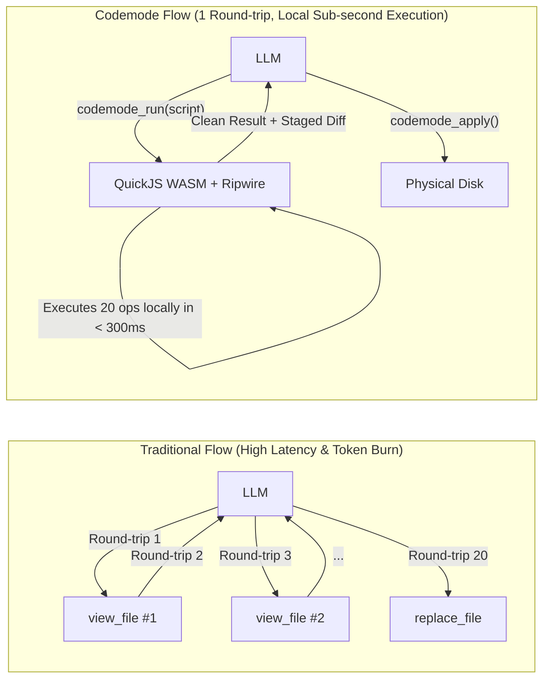

# Usage Guide: Antigravity Codemode Plugin

> **Version:** 1.0.0  
> **Architecture:** QuickJS WebAssembly Sandbox + Ripwire v0.6.5 + Staging Filesystem  
> **Protocol:** Model Context Protocol (MCP stdio)

---

## 1. What is Codemode and Why Use It?

In traditional AI coding assistants (*sequential cloud tool-calling*), complex exploration or refactoring creates severe latency and token-exhaustion bottlenecks:
- **Traditional Model:** The LLM issues 15 to 30 individual tool calls (`list_directory`, `view_file`, `grep_search`, `replace_file_content`), making a cloud round-trip for each one. Every call consumes prompt and completion tokens, compounding into 20–60 seconds of waiting time.
- **Codemode Model:** The LLM writes a **single asynchronous JavaScript script** and dispatches it locally via `codemode_run`. The script executes in milliseconds inside a WebAssembly QuickJS virtual machine, traverses the code graph with Ripwire, filters data in sandbox memory, and returns **only the compact consolidated answer and staged diff**.



---

## 2. MCP Tools Exposed to Antigravity

The plugin exposes 3 primary tools through the MCP server:

### 2.1. `codemode_run`
Executes asynchronous JavaScript code within the secure QuickJS WebAssembly sandbox.
- **Parameters:**
  - `code` (string, required): Asynchronous JavaScript body to execute.
  - `timeoutMs` (number, optional): Maximum execution timeout in milliseconds (default: 60,000 ms).
- **Staging-First Guarantee:** File mutations do not touch the physical disk immediately. They are buffered in an in-memory staging area and reported in `=== Staged Changes ===` as a unified diff.

### 2.2. `codemode_apply`
Atomically applies all currently staged file modifications to the real disk after inspection.
- **Protections:** Optimistic concurrency validation (aborts if files were externally changed), temporary file atomic swap (`.tmp`), and transactional backup with automatic rollback if any I/O operation fails.

### 2.3. `codemode_discard`
Discards the in-memory staging area, aborting all pending edits without modifying any file on disk.

---

## 3. Tool Catalog Available Inside Scripts (`tools.*`)

Inside the JavaScript code passed to `codemode_run`, the script has access to the global `tools` object:

### 3.1. Code Intelligence & Navigation (Ripwire)

| Method | Signature | Description |
| :--- | :--- | :--- |
| `tools["ripwire.map"]` | `({ path?, topK?, maxTokens? })` | Returns central repository symbols ranked by **Personalized PageRank**. |
| `tools["ripwire.callers"]` | `({ symbol, path? })` | Finds all direct 1-hop callers of a function, interface, or class. |
| `tools["ripwire.uses"]` | `({ symbol, path? })` | Finds where a symbol is read, written, instantiated, or imported. |
| `tools["ripwire.impact"]` | `({ symbol, path? })` | **Blast Radius**: Calculates the transitive reach and importing files prior to refactoring. |
| `tools["ripwire.for"]` | `({ task, path?, signaturesOnly? })` | **Task Lens**: Extracts targeted signatures and code anchors for a natural-language task. |
| `tools["ripwire.around"]` | `({ symbol, depth? })` | Computes the local ego-graph surrounding a target symbol. |

### 3.2. Secure Filesystem & Staging (Windows-Hardened)

| Method | Signature | Description |
| :--- | :--- | :--- |
| `tools.readFile` | `({ path, offset?, limit? })` | Reads file content with 64-bit BigInt TOCTOU verification and 5MB size limit. |
| `tools.glob` | `({ pattern, cwd?, ignore? })` | Fast file search matching glob patterns within the repository root. |
| `tools.grep` | `({ query, path?, isRegex?, caseSensitive? })` | Regex/substring search with dedicated Worker-thread ReDoS isolation. |
| `tools.writeFile` | `({ path, content })` | Buffers a full file write or creation in staging memory. |
| `tools.editFile` | `({ path, oldText, newText })` | Replaces an exact single occurrence of `oldText` with `newText` in staging. |
| `tools.getStagedDiff` | `()` | Generates the unified diff of all pending staged modifications. |
| `tools.discardStaged` | `()` | Clears staged modifications from memory. |

---

## 4. Practical Recipes

### Recipe 1: Instant Repository Orientation & Key Symbol Mapping
```javascript
// Map the top 10 most influential architectural files and their symbols
const map = await tools["ripwire.map"]({ topK: 10 });

return {
  totalFiles: map.files,
  totalSymbols: map.symbols,
  architecturalCore: map.r.map(file => ({
    path: file.p,
    symbols: file.s.map(sym => sym.n)
  }))
};
```

### Recipe 2: Pre-Refactor Blast Radius Analysis
```javascript
// Check who calls `resolvePath` and what will be affected before modifying it
const callers = await tools["ripwire.callers"]({ symbol: "resolvePath" });
const blastRadius = await tools["ripwire.impact"]({ symbol: "resolvePath" });

return {
  directCallersCount: callers.count,
  directCallers: callers.callers,
  transitiveReach: blastRadius.reaches,
  affectedFiles: blastRadius.import_reach
};
```

### Recipe 3: Multi-File Batch Refactoring with Staging
```javascript
// Update dependencies or configuration across multiple packages in one atomic turn
const packages = await tools.glob({ pattern: "**/package.json" });

for (const pkg of packages) {
  const content = await tools.readFile({ path: pkg });
  if (content.includes('"lodash": "^4.17.20"')) {
    await tools.editFile({
      path: pkg,
      oldText: '"lodash": "^4.17.20"',
      newText: '"lodash": "^4.17.21"'
    });
  }
}

return { inspected: packages.length };
```

---

## 5. Security & Operating Principles

1. **Staging-First Safety:** Code running inside `codemode_run` cannot directly mutate the physical disk. File changes produce an in-memory diff that requires external invocation of `codemode_apply` to commit.
2. **Deterministic Execution:** The QuickJS WASM runtime operates with a strict 30-second execution deadline and a 128 MB memory limit.
3. **Windows NTFS Hardening:** Strict path canonicalization prevents UNC access (`\\`), device paths (`\\?\`), Alternate Data Streams (`:`), and MS-DOS reserved device names (`CON`, `PRN`, `AUX`, `NUL`, etc.).
4. **ReDoS Immunity:** Regular expression evaluations in `grep` run inside an isolated Worker thread with a 600ms watchdog timeout, preventing thread-blocking catastrophic backtracking.
